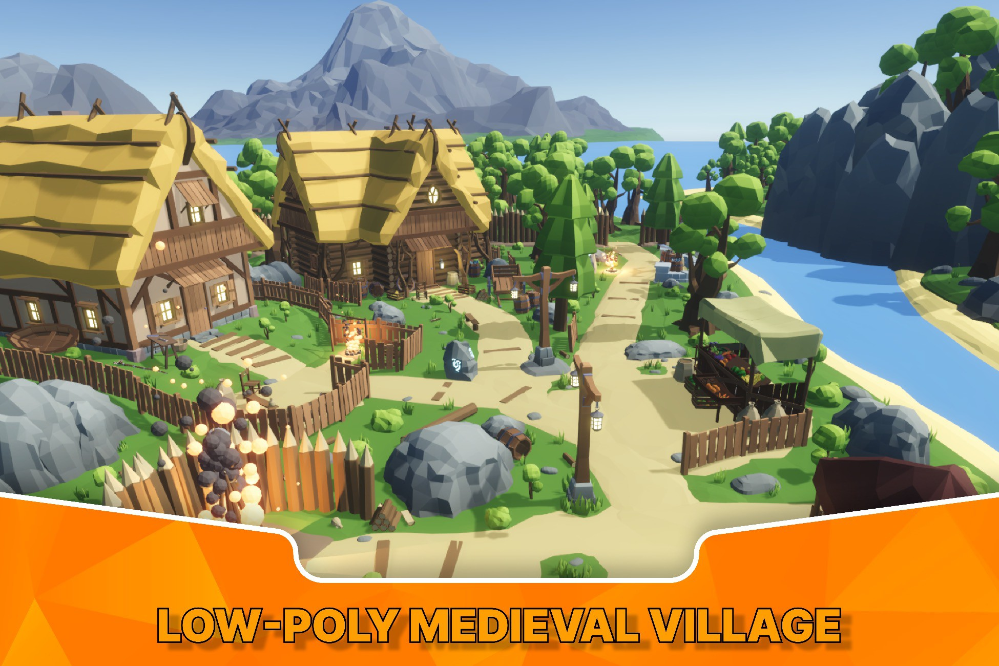
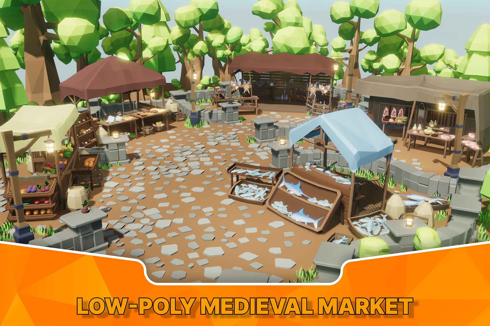
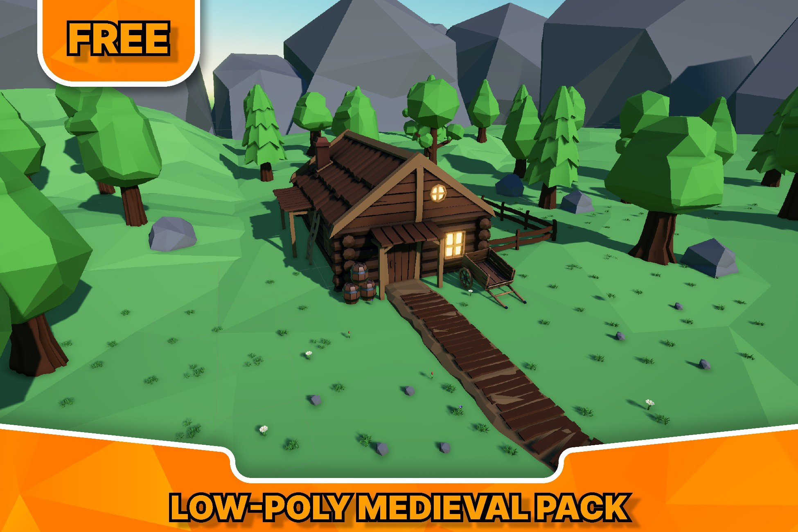

# 🔥 Vanilla ArtStudio

## 📌 Краткое описание
**Vanilla ArtStudio** — небольшая студия по созданию 3D-ассетов для игр.  
Мы делали упор на высокое качество моделей и оптимизацию для Unity.  
Ассеты публиковались на **Unity Asset Store** и использовались разработчиками в их проектах.  

---

## 🚀 Платформы
- Unity Asset Store  

---

## 📦 Публикации
👉 [Главная страница Vanilla ArtStudio](https://assetstore.unity.com/publishers/83046)  

- [Low-Poly Medieval Village](https://assetstore.unity.com/packages/3d/environments/low-poly-medieval-village-274198)  
- [Low-Poly Medieval Market](https://assetstore.unity.com/packages/3d/environments/low-poly-medieval-market-262473)  
- [Low-poly Medieval Free Pack](https://assetstore.unity.com/packages/3d/environments/low-poly-medieval-free-pack-253520)  

---

## 🧠 Основные направления Vanilla ArtStudio
- Создание 3D-моделей высокого качества (low-poly и stylized)  
- Оптимизация ассетов для Unity (LOD, материалы, текстуры)  
- Разработка кастомных шейдеров  
- Поддержка ассетов и обновления  
- Публикация и продвижение на Unity Asset Store  

---

## 🛠 Технологии
- Unity 3D  
- Blender / Maya  
- Substance Painter  
- Shader Graph / HLSL  
- Git  

---

## 👩‍💻 Мой вклад
- Организация и руководство командой из 2 художников  
- Создание и настройка шейдеров для ассетов  
- Контроль качества и оптимизации моделей  
- Подготовка ассетов к публикации (LOD, материалы, текстуры)  
- Паблишинг ассетов в Unity Asset Store  
- Взаимодействие с пользователями, поддержка и обновления  

---

## 🏁 Вывод
**Vanilla ArtStudio** дало мне уникальный опыт в управлении творческой командой и публикации коммерческих ассетов.  
Я научился вести процесс от идеи и шейдеров до публикации и поддержки в магазине.  
Это был отличный шанс соединить технические и лидерские навыки в одном проекте.  

---

## 📸 Скриншоты / Примеры ассетов

  
[Low-Poly Medieval Village](https://www.youtube.com/watch?v=htZ7A0LnwjU)  

  
[Low-Poly Medieval Market](https://www.youtube.com/watch?v=iUDKvu8qs9M) 

  
[Low-poly Medieval Free Pack](https://assetstore.unity.com/packages/3d/environments/low-poly-medieval-free-pack-253520) 
