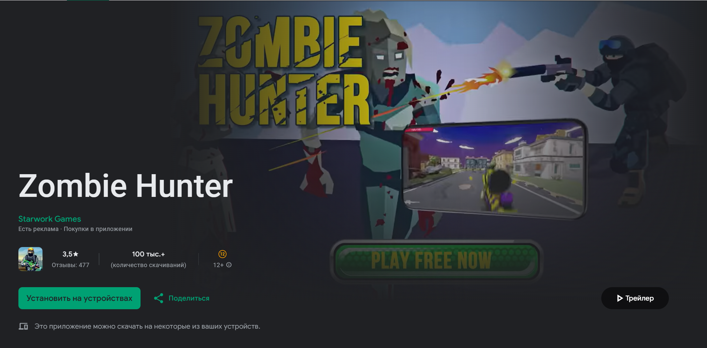
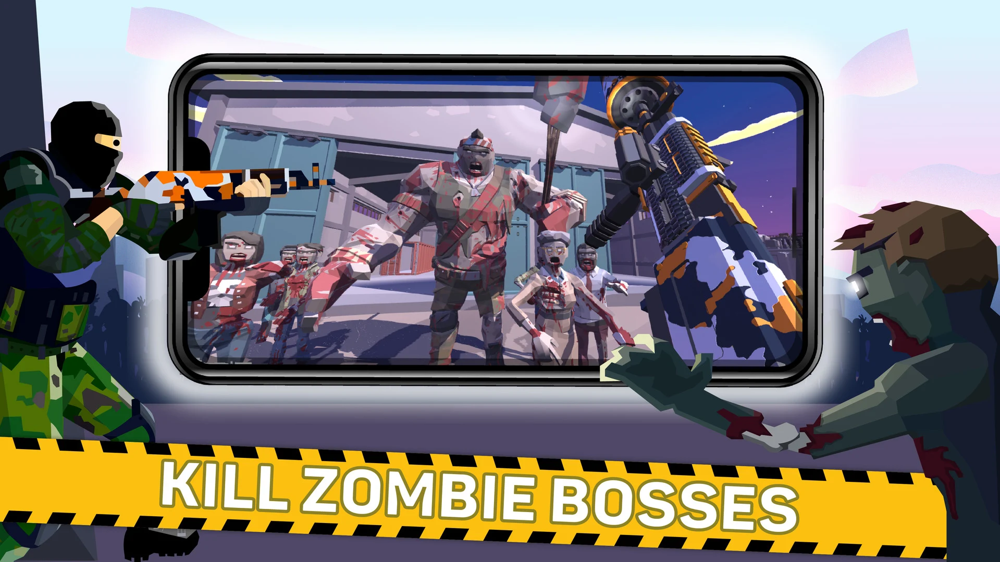
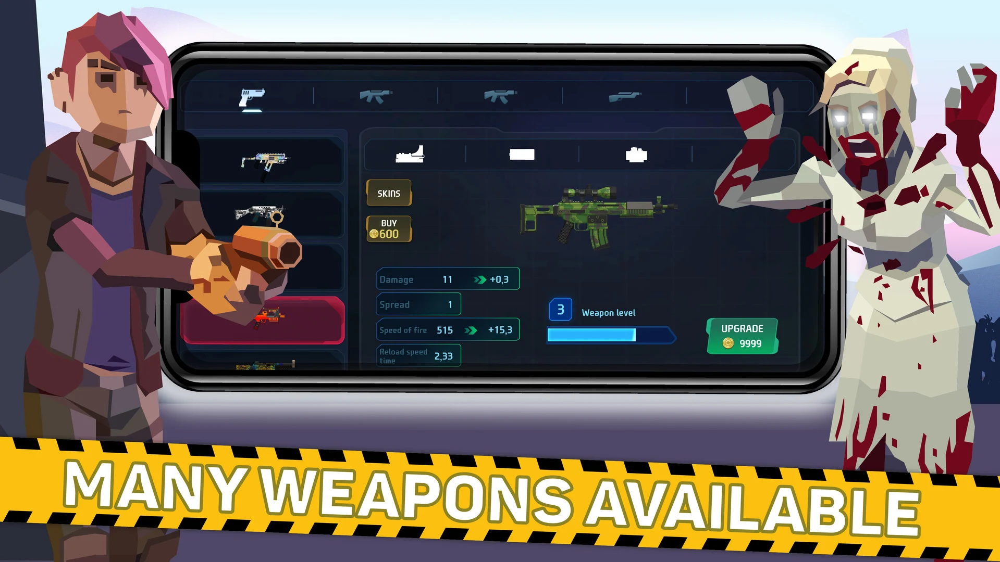
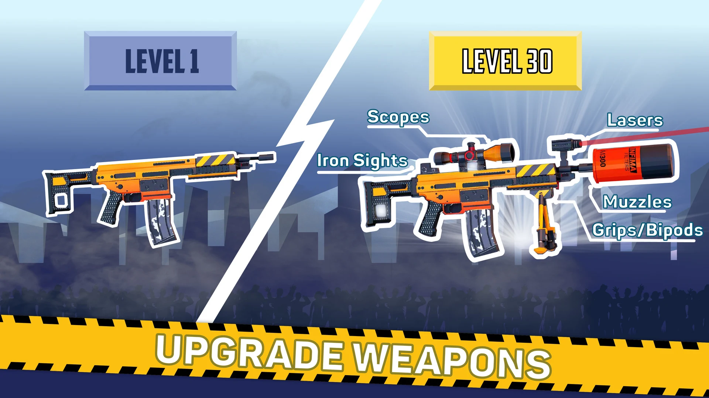
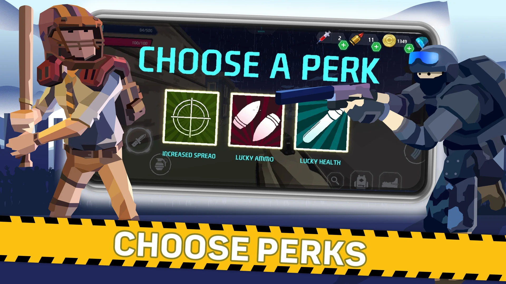
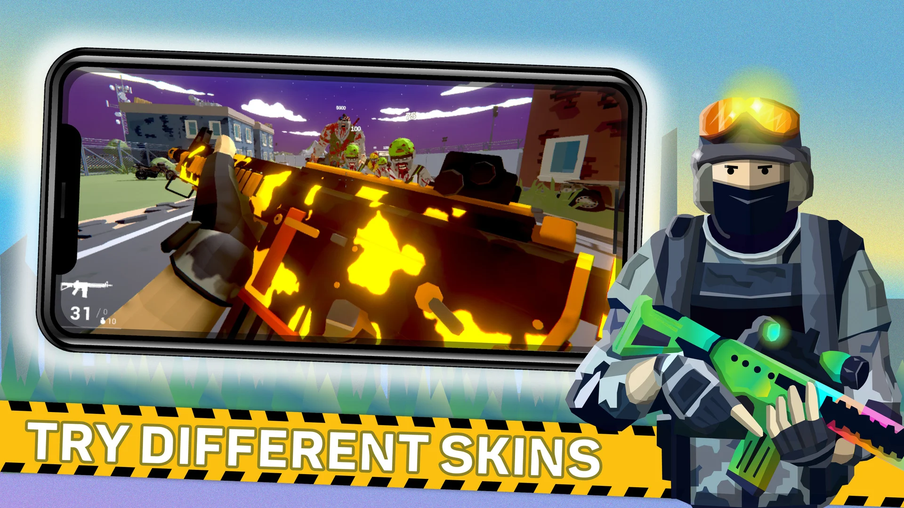

# 🔥 Zombie Hunter

  

## 📌 Краткое описание
**Zombie Hunter** — 3D-шутер для мобильных устройств.  
Я занимался анимацией, дизайном, оптимизацией 3D-моделей и настройкой визуальных эффектов.  
Разработал логику для боссов и врагов, боевую механику (стрельба, броски гранат, удары ножом) и различные игровые сервисы, включая погоду и управление звуком.  

---

## 🚀 Платформы
- iOS / Android  
- Unity  

---

## 📦 Демо / Ссылки
👉 [Главная страница проекта Zombie Hunter](https://play.google.com/store/apps/details?id=zombie.shooter.hunter.starwork)

---

## 🧠 Основные направления
- Создание и оптимизация 3D-анимаций  
- Разработка логики врагов и боссов  
- Реализация боевой механики: стрельба, гранаты, ножевые атаки  
- Настройка визуальных эффектов и спецэффектов  
- Создание игровых сервисов: управление погодой, звуком и окружением  

---

## 🛠 Технологии
- Unity 3D  
- C#  
- Blender / Maya  
- Shader Graph / Visual Effects Graph  
- Git / GitHub  

---

## 👩‍💻 Мой вклад
- Создание анимаций для персонажей и врагов  
- Настройка боевой логики и механик игрока и NPC  
- Оптимизация 3D-моделей и сцен  
- Настройка визуальных и звуковых эффектов  
- Разработка игровых сервисов (погода, звук)  

---

## 🏁 Вывод
**Zombie Hunter** дал мне опыт комплексной работы над мобильной 3D-игрой: от анимации и визуальных эффектов до боевой логики и игровых сервисов.  
Я развил навыки оптимизации, работы с визуальными эффектами и созданием интерактивной боевой системы.  

---

## 📸 Скриншоты / Примеры
 

