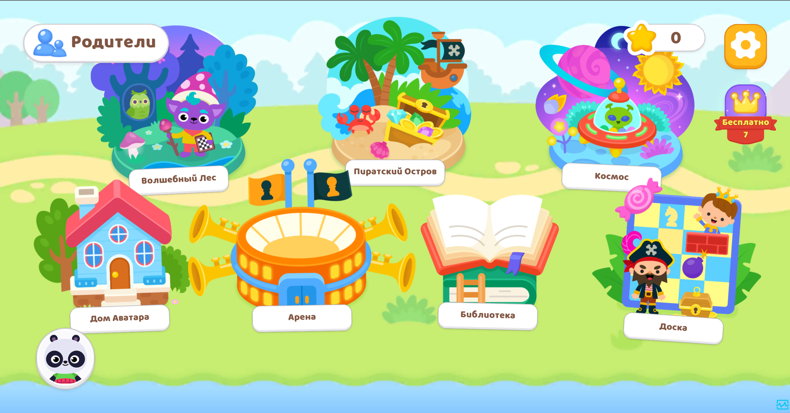

# 🔥 FenomenKids

## 📌 Краткое описание
**FenomenKids** — образовательная игровая платформа, где дети учатся играть в шахматы в игровой форме.  
Проект объединяет шахматные партии с элементами прогрессии, питомцами, декорациями и обучающими уровнями, превращая обучение в увлекательное приключение.  

---

## 🚀 Платформы
- WebGL  
- Android  
- iOS  

---

## 🎮 Играбельная версия
👉 [Сайт проекта](https://fenomen-kids.ru/site/)  
👉 [RuStore](https://www.rustore.ru/catalog/app/com.DefaultCompany.FenomenKids)  

---

## 🧠 Основные механики FenomenKids
- Игры в шахматы против AI и в мультиплеере  
- Питомцы и декорации как система прогрессии  
- Обучающие уровни и квесты  
- Система достижений и наград  
- Социальные элементы (профиль, прогресс, сохранения)  
- База данных для хранения статистики игроков  

---

## 🛠 Технологии
- Unity 3D (C#, UGUI, Addressables)  
- DI: Zenject, VContainer  
- Асинхронность: UniTask, async/await  
- Анимации: DOTween  
- Backend: Node.js, SQL, WebSocket, REST API  
- Архитектура: MVVM, Clean Architecture  
- DevOps: CI/CD, Google Tables  
- VCS: Git  

---

## 👩‍💻 Мой вклад
- Реализация искусственного интеллекта для шахматных партий  
- Создание мультиплеера и логики сетевых матчей  
- Разработка металогики (питомцы, декорации, прогрессия)  
- Проектирование и интеграция базы данных  
- Настройка фронтенда и бэкенда (Unity + Node.js)  
- Поддержка DevOps и деплоя на разные платформы  
- Создание UI/UX с анимацией и оптимизацией  
- Оптимизация производительности и логики  

---

## 🏁 Вывод
Работа над **FenomenKids** стала для меня ключевым опытом в создании **образовательных игр с глубокой архитектурой**.  
Проект позволил объединить игровой процесс, мультиплеер, обучение и прогрессию в единую экосистему.  
Я получил ценный опыт не только в геймдеве, но и в **разработке backend-сервисов, интеграции AI и DevOps**, что значительно расширило мои навыки как Unity-разработчика.  

---

## 📸 Скриншоты / Видео

  
  

